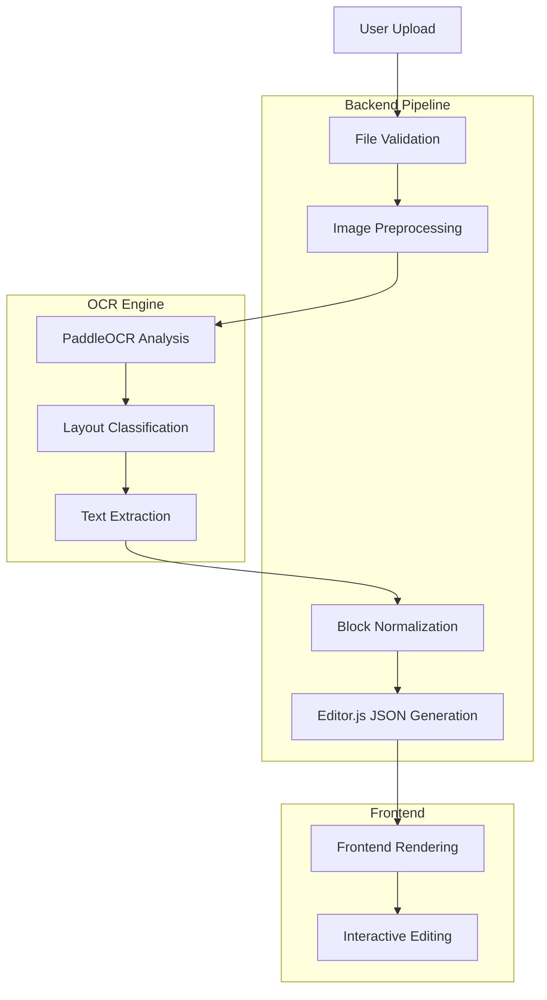

# Design Document: PDF to Editable Web Layout System

## Overview

The PDF to Editable Web Layout system transforms scanned PDF documents into structured, editable web content using a flow-based reconstruction approach. The system leverages PaddleOCR's PP-Structure for intelligent layout analysis and Editor.js for providing an intuitive editing interface. This design prioritizes logical content structure over absolute positioning, enabling natural content editing and manipulation.

The system architecture follows a clear separation of concerns with a Python-based backend handling OCR processing and data transformation, and a JavaScript frontend providing the editing interface. The design emphasizes reliability, performance, and user experience while maintaining data integrity throughout the conversion pipeline.

## Architecture

### System Components

The system consists of three primary components working in coordination:

1. **Backend Processing Pipeline (Python)**
   - File upload and validation service
   - OCR processing coordination
   - Data normalization and transformation
   - API endpoint management

2. **OCR Analysis Engine (PaddleOCR PP-Structure)**
   - Layout detection and classification
   - Table structure recognition
   - Text extraction with confidence scoring
   - Region coordinate mapping

3. **Frontend Editor Interface (Editor.js)**
   - Block-based content rendering
   - Interactive editing capabilities
   - Real-time content manipulation
   - Export and save functionality

### Data Flow Architecture



### Processing Pipeline

The conversion process follows a structured pipeline ensuring data integrity and optimal performance:

1. **Input Validation Phase**
   - File type verification (PDF, JPG, PNG)
   - Size limit enforcement (10MB maximum)
   - Format compatibility checking
   - Security scanning for malicious content

2. **OCR Processing Phase**
   - Image extraction from PDF (if applicable)
   - Layout analysis using PP-Structure
   - Text region identification and classification
   - Table structure detection and parsing
   - Confidence score calculation for all extracted elements

3. **Normalization Phase**
   - OCR result parsing and validation
   - Content block classification (heading, paragraph, table, list)
   - Hierarchy determination for heading structures
   - Text formatting preservation
   - Coordinate-to-flow conversion

4. **Output Generation Phase**
   - Editor.js block structure creation
   - JSON schema validation
   - Content integrity verification
   - Response formatting and delivery

## Components and Interfaces

### Backend API Interface

The backend exposes a RESTful API with the following key endpoints:

**POST /api/convert**
- Accepts multipart file upload
- Returns conversion job identifier
- Initiates asynchronous processing pipeline

**GET /api/convert/{job_id}/status**
- Returns processing status and progress
- Provides error information if processing fails
- Includes estimated completion time

**GET /api/convert/{job_id}/result**
- Returns Editor.js compatible JSON structure
- Includes metadata about conversion quality
- Provides confidence scores for extracted content

### OCR Engine Interface

The system interfaces with PaddleOCR through a structured wrapper providing:

**Layout Analysis Service**
```python
class LayoutAnalyzer:
    def analyze_layout(self, image_path: str) -> LayoutResult
    def extract_tables(self, image_path: str, regions: List[Region]) -> List[TableStructure]
    def extract_text(self, image_path: str, regions: List[Region]) -> List[TextBlock]
```

**Data Structures**
```python
@dataclass
class LayoutResult:
    regions: List[Region]
    confidence_score: float
    processing_time: float

@dataclass
class Region:
    coordinates: BoundingBox
    classification: RegionType
    confidence: float
    content: Optional[str]

@dataclass
class TableStructure:
    rows: int
    columns: int
    cells: List[List[str]]
    coordinates: BoundingBox
```

### Frontend Editor Interface

The frontend implements Editor.js with custom block types and plugins:

**Custom Block Types**
- Enhanced table blocks with cell-level editing
- Hierarchical heading blocks with automatic numbering
- Rich text paragraph blocks with formatting preservation
- Image blocks for non-text content regions

**Editor Configuration**
```javascript
const editorConfig = {
  holder: 'editor-container',
  tools: {
    header: HeaderTool,
    paragraph: ParagraphTool,
    table: TableTool,
    image: ImageTool
  },
  data: convertedBlocks,
  readOnly: false,
  placeholder: 'Start editing your converted document...'
};
```

## Data Models

### Core Data Structures

**Document Model**
```python
class Document:
    id: str
    original_filename: str
    file_type: str
    upload_timestamp: datetime
    processing_status: ProcessingStatus
    conversion_result: Optional[EditorJSData]
    error_message: Optional[str]
    confidence_metrics: ConfidenceMetrics
```

**Editor.js Block Model**
```typescript
interface EditorBlock {
  id: string;
  type: 'header' | 'paragraph' | 'table' | 'image';
  data: BlockData;
  metadata?: {
    confidence: number;
    originalCoordinates: BoundingBox;
    processingNotes: string[];
  };
}

interface TableBlockData extends BlockData {
  content: string[][];
  withHeadings: boolean;
  stretched: boolean;
}

interface HeaderBlockData extends BlockData {
  text: string;
  level: 1 | 2 | 3 | 4 | 5 | 6;
}
```

### Database Schema

The system uses a lightweight database schema for tracking conversions:

```sql
CREATE TABLE documents (
    id UUID PRIMARY KEY,
    filename VARCHAR(255) NOT NULL,
    file_type VARCHAR(10) NOT NULL,
    file_size INTEGER NOT NULL,
    upload_time TIMESTAMP DEFAULT CURRENT_TIMESTAMP,
    processing_status VARCHAR(20) DEFAULT 'pending',
    result_json JSONB,
    error_message TEXT,
    confidence_score DECIMAL(3,2),
    processing_duration INTEGER
);

CREATE TABLE processing_logs (
    id UUID PRIMARY KEY,
    document_id UUID REFERENCES documents(id),
    stage VARCHAR(50) NOT NULL,
    status VARCHAR(20) NOT NULL,
    message TEXT,
    timestamp TIMESTAMP DEFAULT CURRENT_TIMESTAMP
);
```

## Correctness Properties

*A property is a characteristic or behavior that should hold true across all valid executions of a system—essentially, a formal statement about what the system should do. Properties serve as the bridge between human-readable specifications and machine-verifiable correctness guarantees.*

Before defining the correctness properties, I need to analyze the acceptance criteria to determine which ones are testable through property-based testing.

<function_calls>
<invoke name="prework">
<parameter name="featureName">pdf-to-editable-web

### Property Reflection

After analyzing all acceptance criteria, I identified several areas where properties can be consolidated to eliminate redundancy:

- File validation properties (1.1, 1.2, 1.3, 1.5) can be combined into comprehensive input validation properties
- OCR output structure properties (2.1, 2.3, 2.5) can be consolidated into OCR result completeness properties  
- Block conversion properties (3.1, 3.2, 3.3, 3.4) can be unified into mapping correctness properties
- Error handling properties (5.1, 5.2) can be combined into comprehensive error response properties
- Data validation properties (6.1, 6.4) can be merged into output format validation properties

The following properties represent the essential, non-redundant correctness guarantees:

### Correctness Properties

**Property 1: Valid file acceptance**
*For any* valid PDF, JPG, or PNG file under 10MB, the system should accept and initiate processing successfully
**Validates: Requirements 1.1, 1.2**

**Property 2: Invalid file rejection**  
*For any* invalid file type or oversized file, the system should reject the upload and return a descriptive error message
**Validates: Requirements 1.3, 1.5**

**Property 3: Multi-page PDF handling**
*For any* multi-page PDF document, the system should process only the first page and notify the user about the limitation
**Validates: Requirements 1.4**

**Property 4: OCR result completeness**
*For any* successfully processed document, the OCR engine should return structured data containing region coordinates, text content, layout classifications, and confidence scores
**Validates: Requirements 2.1, 2.3, 2.5**

**Property 5: Table structure recognition**
*For any* document containing table structures, the OCR engine should recognize and classify them with appropriate structural metadata
**Validates: Requirements 2.2**

**Property 6: OCR error handling**
*For any* OCR processing failure, the system should return detailed error information including specific failure reasons
**Validates: Requirements 2.4**

**Property 7: Block mapping correctness**
*For any* OCR result containing text regions, the backend should map them to appropriate Editor.js block types (header, paragraph, table) with correct hierarchy
**Validates: Requirements 3.1, 3.3**

**Property 8: Table conversion accuracy**
*For any* detected table structure, the backend should convert it to a valid Editor.js table block preserving row and column relationships
**Validates: Requirements 3.2, 6.2**

**Property 9: Text formatting preservation**
*For any* paragraph text with formatting, the conversion process should preserve the formatting in the resulting Editor.js blocks
**Validates: Requirements 3.4**

**Property 10: Editor.js schema compliance**
*For any* generated output, all Editor block structures should validate against the Editor.js schema specification
**Validates: Requirements 3.5, 6.1**

**Property 11: Block rendering order**
*For any* set of converted blocks, the web editor should render them in the same logical flow order as they appeared in the original document
**Validates: Requirements 4.1**

**Property 12: Interactive editing enablement**
*For any* rendered text block, clicking on it should enable inline editing capabilities for that specific content
**Validates: Requirements 4.2**

**Property 13: Table editing structure preservation**
*For any* table block modification, the editor should preserve the table structure while allowing individual cell content editing
**Validates: Requirements 4.3**

**Property 14: Comprehensive error messaging**
*For any* system failure (upload, OCR, conversion), the system should return user-friendly error messages with specific guidance
**Validates: Requirements 5.1, 5.2**

**Property 15: Low confidence warnings**
*For any* conversion result with confidence scores below threshold, the system should warn users about potential accuracy issues
**Validates: Requirements 5.3**

**Property 16: Network retry behavior**
*For any* network error during processing, the system should retry operations exactly 3 times before failing
**Validates: Requirements 5.4**

**Property 17: Privacy-preserving error logging**
*For any* error condition, the system should log sufficient debugging detail while excluding personally identifiable information
**Validates: Requirements 5.5**

**Property 18: Character encoding handling**
*For any* text content containing special characters or various encodings, the system should handle them correctly without corruption
**Validates: Requirements 6.3**

**Property 19: JSON serialization validity**
*For any* system output, the generated JSON should be well-formed and parse without errors
**Validates: Requirements 6.4**

**Property 20: Content integrity preservation**
*For any* text content processed through the pipeline, the final output should preserve the original text without data loss
**Validates: Requirements 6.5**

**Property 21: Processing time compliance**
*For any* single-page document under normal system load, processing should complete within 30 seconds
**Validates: Requirements 7.1**

**Property 22: Memory usage limits**
*For any* OCR processing operation, memory usage should remain within system-defined limits to prevent resource exhaustion
**Validates: Requirements 7.3**

**Property 23: Resource cleanup completeness**
*For any* processing operation that creates temporary files, all temporary resources should be cleaned up after completion
**Validates: Requirements 7.4**

**Property 24: Status update provision**
*For any* long-running processing operation, the system should provide regular status updates to prevent user timeout concerns
**Validates: Requirements 7.5**

## Error Handling

### Error Classification and Response Strategy

The system implements a comprehensive error handling strategy addressing different failure modes:

**Input Validation Errors**
- File type validation failures return HTTP 400 with supported format guidance
- File size limit violations return HTTP 413 with size limit information
- Malformed requests return HTTP 400 with specific validation error details

**Processing Errors**
- OCR engine failures return HTTP 500 with retry suggestions
- Memory exhaustion returns HTTP 503 with temporary unavailability notice
- Timeout errors return HTTP 408 with processing status information

**Data Integrity Errors**
- Schema validation failures return HTTP 422 with specific validation errors
- Content corruption detection returns HTTP 500 with data integrity warnings
- Encoding issues return HTTP 400 with character encoding guidance

### Error Recovery Mechanisms

**Automatic Retry Logic**
```python
class RetryableOperation:
    def __init__(self, max_retries=3, backoff_factor=2):
        self.max_retries = max_retries
        self.backoff_factor = backoff_factor
    
    def execute_with_retry(self, operation, *args, **kwargs):
        for attempt in range(self.max_retries + 1):
            try:
                return operation(*args, **kwargs)
            except RetryableException as e:
                if attempt == self.max_retries:
                    raise FinalFailureException(f"Failed after {self.max_retries} retries: {e}")
                time.sleep(self.backoff_factor ** attempt)
```

**Graceful Degradation**
- Low confidence OCR results trigger manual review workflows
- Partial processing failures return successfully processed portions
- Network connectivity issues enable offline processing queues

## Testing Strategy

### Dual Testing Approach

The system employs both unit testing and property-based testing to ensure comprehensive coverage and correctness validation.

**Unit Testing Focus Areas**
- Specific file format handling examples (PDF, JPG, PNG)
- Edge cases in OCR result parsing
- Error condition handling for known failure modes
- Integration points between system components
- Editor.js block structure validation examples

**Property-Based Testing Configuration**

The system uses Hypothesis (Python) for backend property testing and fast-check (JavaScript) for frontend property testing. Each property test runs a minimum of 100 iterations to ensure statistical confidence in correctness validation.

**Backend Property Tests (Python/Hypothesis)**
```python
@given(valid_pdf_file())
def test_valid_pdf_acceptance(pdf_file):
    """Feature: pdf-to-editable-web, Property 1: Valid file acceptance"""
    result = upload_service.process_file(pdf_file)
    assert result.status == ProcessingStatus.ACCEPTED
    assert result.job_id is not None

@given(invalid_file_type())
def test_invalid_file_rejection(invalid_file):
    """Feature: pdf-to-editable-web, Property 2: Invalid file rejection"""
    with pytest.raises(ValidationError) as exc_info:
        upload_service.process_file(invalid_file)
    assert "descriptive error message" in str(exc_info.value)
```

**Frontend Property Tests (JavaScript/fast-check)**
```javascript
fc.test('Feature: pdf-to-editable-web, Property 11: Block rendering order', 
  fc.array(fc.record({
    type: fc.constantFrom('header', 'paragraph', 'table'),
    data: fc.object(),
    order: fc.integer()
  })), 
  (blocks) => {
    const sortedBlocks = blocks.sort((a, b) => a.order - b.order);
    const renderedOrder = editor.render(blocks);
    expect(renderedOrder.map(b => b.order)).toEqual(sortedBlocks.map(b => b.order));
  }
);
```

**Property Test Coverage Requirements**
- Each correctness property must be implemented as a single property-based test
- Tests must reference their corresponding design document property number
- Minimum 100 iterations per property test due to randomization
- Test generators must cover edge cases and boundary conditions
- All property tests must include proper error condition handling

**Integration Testing Strategy**
- End-to-end pipeline testing with real document samples
- Performance testing under various load conditions
- Cross-browser compatibility testing for Editor.js interface
- API contract testing between backend and frontend components

The testing strategy ensures that both specific examples work correctly (unit tests) and that universal properties hold across all possible inputs (property tests), providing comprehensive validation of system correctness and reliability.