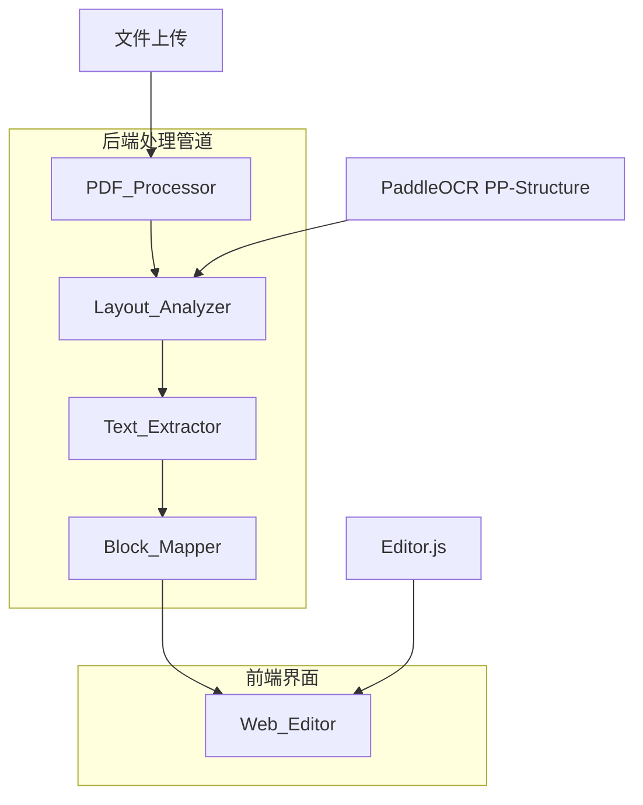

# 设计文档

## 概述

PDF to Web Layout 系统是一个将扫描PDF文档和图片转换为结构化、可编辑web格式的处理管道。系统使用PaddleOCR PP-Structure进行布局分析和表格识别，然后将提取的内容映射到Editor.js block格式，最终在web界面中提供可编辑的文档。

核心设计原则：
- **模块化架构**: 独立的处理组件便于维护和扩展
- **流式布局**: 从绝对定位转换为自然流动的web布局
- **结构保持**: 保持原始文档的逻辑层次和关系
- **可编辑性**: 输出格式支持实时编辑和修改

## 架构

系统采用分层架构，包含以下主要组件：



### 处理流程

1. **文件接收**: 用户上传PDF/图片文件
2. **布局分析**: 使用PaddleOCR PP-Structure识别文档结构
3. **文本提取**: OCR处理提取文本内容
4. **内容规范化**: 清理和标准化提取的文本
5. **Block映射**: 转换为Editor.js JSON格式
6. **Web渲染**: 在Editor.js界面中显示可编辑内容

## 组件和接口

### PDF_Processor

**职责**: 处理文件上传和基本验证

**接口**:
```python
class PDFProcessor:
    def process_file(self, file_path: str, file_type: str) -> ProcessedDocument:
        """处理上传的文件并返回处理后的文档对象"""
        pass
    
    def validate_file(self, file_path: str, file_type: str) -> bool:
        """验证文件格式和大小"""
        pass
```

**输入**: 文件路径和类型
**输出**: ProcessedDocument对象，包含文件元数据和内容

### Layout_Analyzer

**职责**: 使用PaddleOCR PP-Structure进行布局分析

**接口**:
```python
class LayoutAnalyzer:
    def analyze_layout(self, document: ProcessedDocument) -> LayoutResult:
        """分析文档布局并识别结构元素"""
        pass
    
    def detect_regions(self, image_data: bytes) -> List[Region]:
        """检测文档中的不同区域（标题、段落、表格等）"""
        pass
```

**核心功能**:
- 使用PP-Structure模型进行布局检测
- 识别文本区域、表格、标题等元素
- 提供区域坐标和分类信息
- 支持多列布局的阅读顺序恢复

### Text_Extractor

**职责**: 从识别的区域中提取和规范化文本

**接口**:
```python
class TextExtractor:
    def extract_text(self, regions: List[Region]) -> List[TextBlock]:
        """从区域中提取文本内容"""
        pass
    
    def normalize_text(self, raw_text: str) -> str:
        """规范化文本格式和空白字符"""
        pass
    
    def extract_table_content(self, table_region: Region) -> TableData:
        """专门处理表格内容提取"""
        pass
```

**处理逻辑**:
- OCR文本识别和提取
- 空白字符规范化
- 表格单元格内容分离
- 错误处理和日志记录

### Block_Mapper

**职责**: 将提取的内容转换为Editor.js block格式

**接口**:
```python
class BlockMapper:
    def map_to_blocks(self, text_blocks: List[TextBlock]) -> EditorJSData:
        """将文本块转换为Editor.js格式"""
        pass
    
    def create_header_block(self, text: str, level: int) -> Block:
        """创建标题block"""
        pass
    
    def create_paragraph_block(self, text: str) -> Block:
        """创建段落block"""
        pass
    
    def create_table_block(self, table_data: TableData) -> Block:
        """创建表格block"""
        pass
```

**映射规则**:
- 标题 → Editor.js header blocks (level 1-6)
- 段落 → Editor.js paragraph blocks
- 表格 → Editor.js table blocks
- 列表 → Editor.js list blocks
- 未识别内容 → 默认paragraph blocks

### Web_Editor

**职责**: 提供基于Editor.js的web编辑界面

**接口**:
```javascript
class WebEditor {
    constructor(containerId, editorConfig) {
        // 初始化Editor.js实例
    }
    
    loadData(editorJSData) {
        // 加载转换后的数据
    }
    
    saveData() {
        // 保存编辑后的数据
    }
    
    exportToHTML() {
        // 导出为HTML格式
    }
}
```

## 数据模型

### ProcessedDocument
```python
@dataclass
class ProcessedDocument:
    file_path: str
    file_type: str
    file_size: int
    image_data: bytes
    metadata: Dict[str, Any]
```

### Region
```python
@dataclass
class Region:
    bbox: Tuple[int, int, int, int]  # x1, y1, x2, y2
    region_type: str  # 'text', 'table', 'image', 'title'
    confidence: float
    content: Optional[str] = None
```

### TextBlock
```python
@dataclass
class TextBlock:
    text: str
    block_type: str  # 'header', 'paragraph', 'table', 'list'
    level: Optional[int] = None  # for headers
    position: int  # reading order
    metadata: Dict[str, Any] = field(default_factory=dict)
```

### TableData
```python
@dataclass
class TableData:
    rows: List[List[str]]
    headers: Optional[List[str]] = None
    caption: Optional[str] = None
```

### EditorJSData
```python
@dataclass
class EditorJSData:
    time: int
    blocks: List[Block]
    version: str

@dataclass
class Block:
    id: str
    type: str
    data: Dict[str, Any]
```

## 错误处理

### 错误类型和处理策略

**文件处理错误**:
- 不支持的文件格式 → 返回明确的错误消息和支持格式列表
- 文件损坏或无法读取 → 提供文件检查建议
- 文件过大 → 提供大小限制信息

**OCR处理错误**:
- 图像质量过低 → 建议提高图像分辨率
- 无法识别文本 → 提供手动输入选项
- 部分识别失败 → 返回部分结果并标记问题区域

**转换错误**:
- 布局分析失败 → 降级为简单文本处理
- Block映射错误 → 使用默认paragraph格式
- JSON生成错误 → 提供错误详情和恢复建议

### 错误恢复机制

```python
class ErrorHandler:
    def handle_ocr_failure(self, region: Region) -> TextBlock:
        """OCR失败时的降级处理"""
        return TextBlock(
            text="[OCR处理失败 - 请手动输入]",
            block_type="paragraph",
            position=region.position
        )
    
    def handle_partial_success(self, results: List[TextBlock], 
                             errors: List[Exception]) -> EditorJSData:
        """部分成功时的处理"""
        # 返回可用结果并添加错误信息blocks
        pass
```

## 测试策略

### 单元测试
- **组件隔离测试**: 每个处理组件的独立功能验证
- **边界条件测试**: 空文件、损坏文件、极大文件的处理
- **错误场景测试**: 各种异常情况的处理验证
- **数据转换测试**: 格式转换的准确性验证

### 集成测试
- **端到端流程测试**: 完整处理管道的功能验证
- **组件接口测试**: 组件间数据传递的正确性
- **性能测试**: 处理时间和资源使用的基准测试

### 测试数据
- **标准文档**: 包含标题、段落、表格的典型文档
- **复杂布局**: 多列、嵌套表格、混合内容的文档
- **边界案例**: 纯图像、纯文本、空白页面等
- **质量变化**: 不同分辨率和清晰度的扫描文档